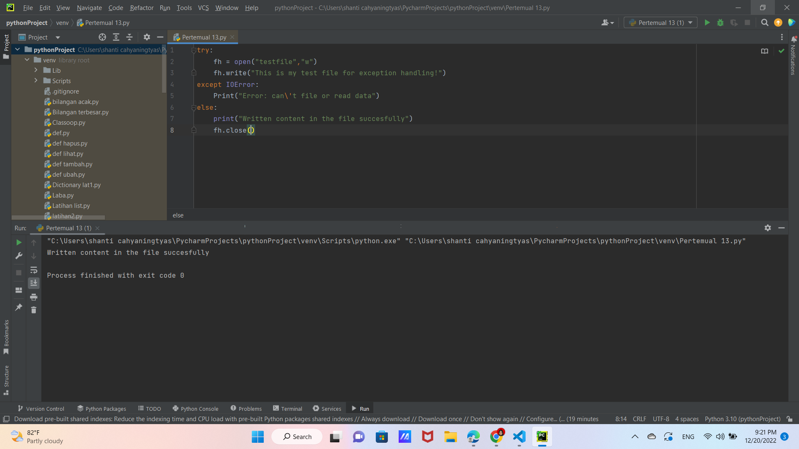
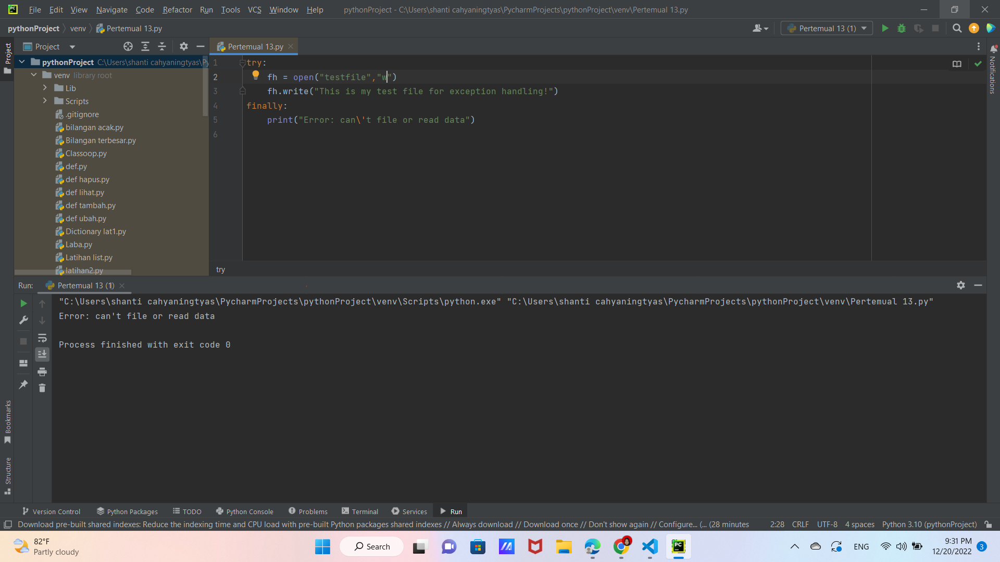
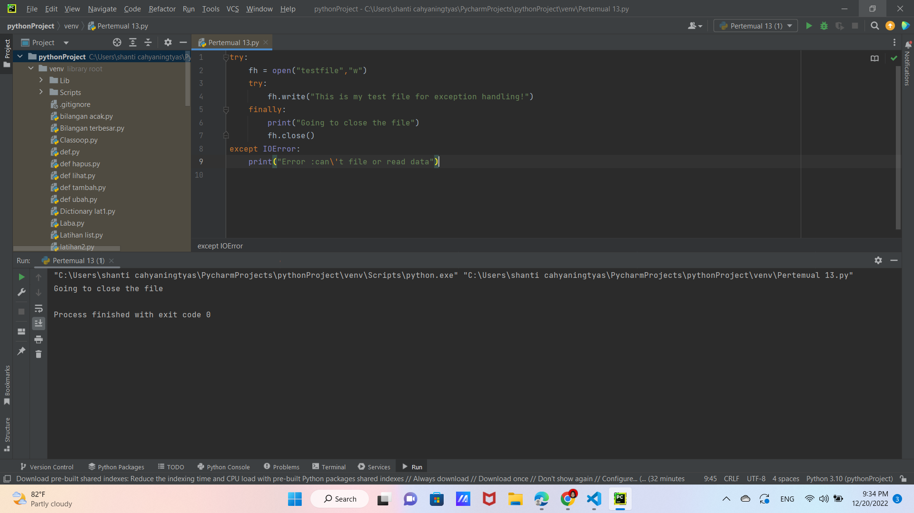
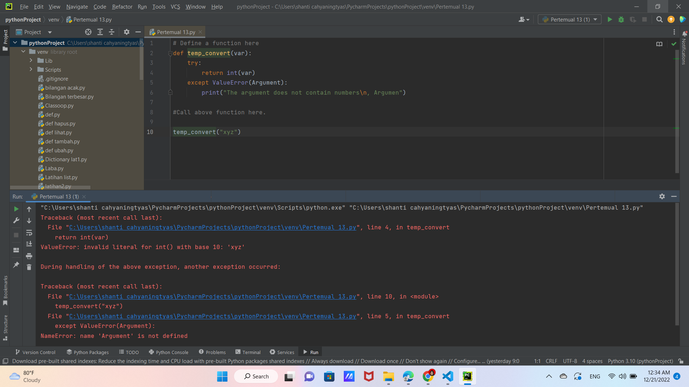
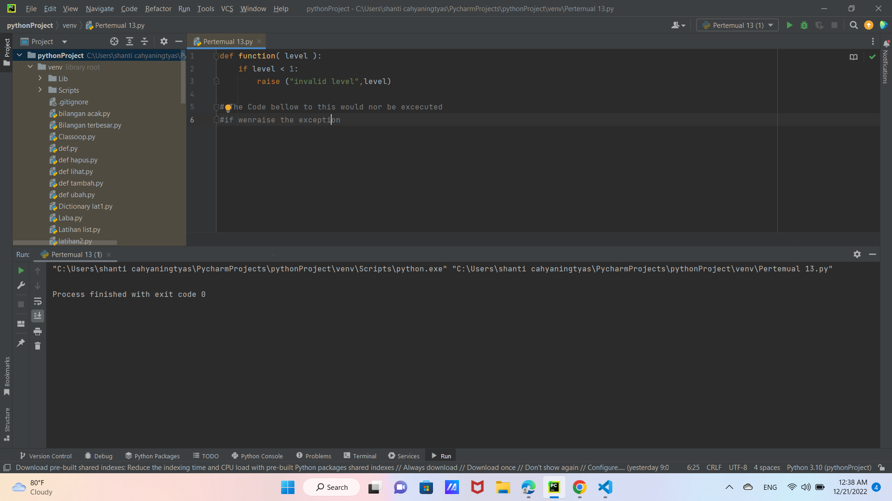
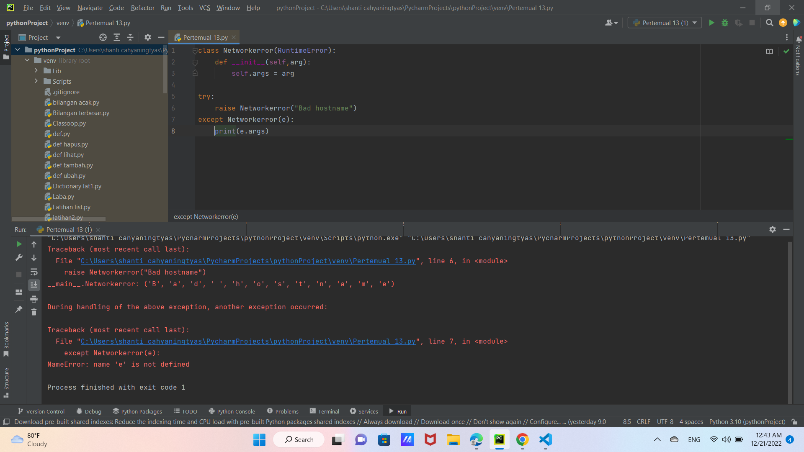

# Praktikum8

# PERTEMUAN 13

## PENANGANAN EKSEPSI

# What is Python Exeption?

Eksepsi (exception) merupakan suatu kesalahan (error) yang terjadi saat proses eksekusi program sedang berjalan,Kesalahan ini akan menyebabkan program berakhir dengan tidak normal. Kesalahan-kesalahan ini dapat diidentifikasikan dengan nama tertentu dan direpresentasikan sebagai objek di dalam python.

## Fitur Eksepsi
Python menyediakan dua fitur yang sangat penting untuk menangani kesalahan tak terduga dalam program dan menambahkan kemampuan debugging di dalamnya, yaitu : 
# 1. Exception Handling 

Exception Handling merupakan mekanisme yang paling diperlukan dalam menangani error yang terjadi pada saat runtime (program berjalan) atau yang lebih dikenal dengan sebutan runtime error. Secara umum, adanya kesalahan / error yang terjadi pada program pada saat runtime dapat menyebabkan program berhenti atau hang.

# 2. Assertions Exception 
Assertions Exception adalah sebuah peristiwa, yang terjadi selama pelaksanaan program yang mengganggu aliran normal instruksi program. Secara umum, ketika skrip Python menemukan situasi yang tidak dapat diatasi, hal itu menimbulkan pengecualian. Exception adalah objek Python yang mewakili kesalahan.

# Contoh 1

- Berikut adalah fungsi yang mengubah suhu dari derajat kelvin menjadi derajat Fahrenheit. Karena nol derajat Kelvin sedingin itu, fungsi ditebus jika melihat suhu negatif.
- Source code & Output dari contoh 1 :

# MENANGANI PENGECUALIAN 

Jika Anda memiliki beberapa kode mencurigakan yang mungkin mengeluarkan pengecualian, Anda dapat mempertahankan program Anda letakkan kode yang mencurigakan di *try: blok. Setelah coba: blok, sertakan pernyataan sertakan *except: statemen, diikuti oleh blok kode yang menangani masalah seanggun mungkin.

# Contoh 2

- Contoh dibawah ini untuk membuka file, menulis konten di file, dan keluar dengan anggun karena ada tidak masalah.
- Source code & Output dari contoh 2 :

# Contoh 3

- Contoh ini mencoba membuka file yang anda tidak memiliki izin menulis, sehingga menimbulkan pengecualian.
- Source code & Output dari contoh 3 :

# Fasal kecuali tanpa pengecualian

Anda juga dapat menggunakan pernyataan exception tanpa exception yang didefinisikan sebagai berikut: 

try: You do your operations here; ...................... 
except: If there is any exception, 
then execute this block. ...................... 
else: If there is no exception then execute this block. 

Pernyataan coba-kecuali jenis ini menangkap semua pengecualian pengecualian yang terjadi. Menggunakan percobaan seperti try-expect pernyataan tidak dianggap sebagai praktik pemrograman yang baik, karena mereka menangkap semuanya pengecualian tetapi tidak membuat programmer mengidentifikasi kemungkinan penyebab masalah terjadi

# Klausa Kecuali dengan Berbagi Pengecualian

Anda juga dapat menggunakan pernyataan exception yang sama untuk menangani beberapa exception sebagai berikut:

try: You do your operations here; ...................... 
except(Exception1[, Exception2[,...ExceptionN]]]): 
If there is any exception from the given exception list, then execute this block. ...................... 
else: If there is no exception then execute this block.

# Klausul Coba Akhirnya 

- Jika anda tidak memiliki izin untuk membuka file dalam mode penulisan, maka ini akan menghasilkan file sebagai berikut :

- Contoh yang sama dapat ditulis lebih bersih sebagai berikut :

Ketika exception dilempar ke dalam blok try, eksekusi segera dilanjutkan ke akhir memblok. Setelah semua pernyataan di blok akhirnya dieksekusi, pengecualian dimunculkan lagi dan ditangani dalam pernyataan kecuali jika ada di lapisan berikutnya yang lebih tinggi dari percobaan-kecuali penyataan.

# ARGUMEN PENELITIAN

# Contoh 6

- Berikut adalah contoh untuk satu pengecualian
- Source code & Output dari contoh 6 :

# Contoh 7

- Pengecualian dapat berupa string, kelas, atau objek. Sebagian besar pengecualian adalah pengecualian dari inti Python menimbulkan adalah kelas, dengan argumen=argumen yang merupakan turunan dari kelas. Mendefinisikan pengecualian barucukup mudah dan dapat dilakukan sebagai berikut:

# Pengecualian yang di tetapkan Pengguna

- Python juga memungkinkan Anda membuat pengecualian sendiri dengan menurunkan kelas-kelas dari yang standar pengecualian bawaan.
- Berikut adalah contoh-contoh yang terkait dengan RuntimeError. Di sini, kelas dibuat yang merupakan subkelas dari subkelas RuntimeError. Ini berguna saat Anda perlumenampilkan tampilan informasi yang lebih spesifik saat e pengecualian tertangkap.
- Di blok coba, pengecualian yang ditentukan pengguna dimunculkan dan ditangkap di blok kecuali. Itu variabel e digunakan untuk membuat instance dari kelas Networkerror.

# Contoh 8

# TERIMA KASIH

